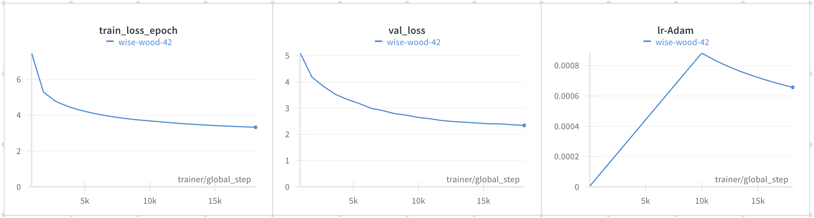

## 1. Summary
### Attention Is All You Need (Transformer) 분석 및 구현 
[논문 분석 노션 링크](https://bit.ly/3Gm5Shx)

### Prepare Dataset
1. raw data: WMT'16 EN-DE Data
2. moses scripts => pre tokenizer, cleaning
3. BPE subwords tokenizer  
#### Result
- `train.tok.clean.bpe.32000.en`: english training input data (4500962)
- `train.tok.clean.bpe.32000.de`: german training output data (4500962)
- `vocab.bpe.32000`: moses tokenizer & BPE tokenizer -> vocabulary (36546)
- `newstest*.tok.clean.bpe.32000.en`: english test input data (22140)
- `newstest*.tok.clean.bpe.32000.de`: german test input data (22140)
#### Reference
- paper: `Massive Exploration of Neural Machine Translation
Architectures`
- docs: `https://google.github.io/seq2seq/nmt/`

#### raw data 변경
- 리소스 대비 데이터 크기가 너무 큼  
    => 더 작은 `Multi30k dataset` 사용

### preprocess
#### german preprocess
1. spacy's language tokenizer
2. token text -> token idx (vocabulary)
#### english preprocess
1. spacy's language tokenizer
2. token text -> token idx (vocabulary)
3. sos, eos token 추가

### train


#### issue
- torch.nn.CrossEntropyLoss(logits, target)
    - logits은 unnormalized 이어야 함
    - softmax의 output을 사용했더니 학습이 거의 되지 않았음

### Inference
- beam search의 score 계산을 위해 softmax를 통해 확률 분포 예측
    => 이때 log_softmax를 사용
    => 각 time에서 예측 분포의 확률 곱을 sum으로 바꾸기 위해 사용


## Instructions
### setting
- install package
    - python=3.8
    ```Bash
    pip install -r requirements.txt
    ```
- usage framework
    - pytorch
    - pytorch-lightning
    - wandb
    - hydra